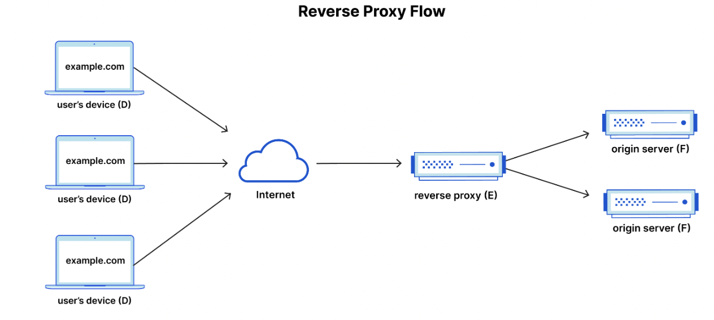
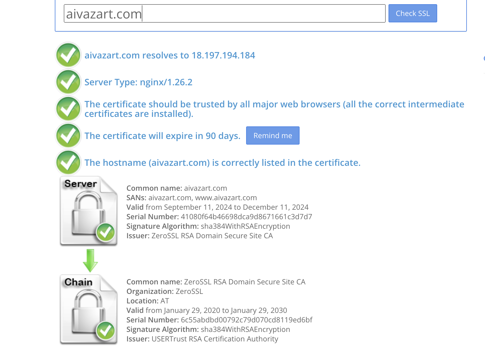

<p align="center">
  
  
</p>

# Deploying a Secure Web Server with Cloudflare, Nginx, and SSL/TLS on AWS EC2

This detailed guide provides step-by-step instructions for setting up a secure web server environment. Starting with the purchase of a domain and launching an EC2 instance on AWS, you'll configure Cloudflare as a reverse proxy to protect and accelerate your site. The guide also covers setting up Nginx to handle web traffic and securing your site with SSL certificates. You’ll learn how to implement multiple types of SSL certificates, including self-signed certificates, Cloudflare Origin SSL, and certificates from trusted providers like Let's Encrypt and ZeroSSL. By the end, your server will be fully configured for high performance and security, including best practices like Forward Secrecy and HTTPS redirection.

## 1. Purchase a Domain
Purchase your own domain. For this guide, the domain was purchased from [domain.com](https://domain.com).


## 2. Launch an EC2 Instance and Assign an Elastic IP
1. Launch an EC2 instance on AWS.
2. Allocate and assign an Elastic IP address to your instance.
3. Open inbound traffic for the following ports:
   - **22**: SSH
   - **80**: HTTP
   - **443**: HTTPS

## 3. Introduction to Cloudflare

Cloudflare is a global cloud reverse proxy that offers services such as caching, DDoS mitigation, and more.

### What is a Reverse Proxy?

A reverse proxy forwards client requests to backend servers. It provides several benefits, including:
- **IP masking**: Hides the IP addresses of your servers.
- **DDoS attack mitigation**: Protects your servers from Distributed Denial of Service (DDoS) attacks.
- **Caching**: Stores web pages and static content, reducing the delay in serving pages when located near clients.



## 4. Set Up Cloudflare

1. Register or log in to your Cloudflare account.
2. Add your site by entering the domain you purchased earlier.
3. Choose the **Free** plan.

## 5. Update Your Domain’s Nameservers

1. Go to **domain.com**.
2. Navigate to **Domains -> Your Domain -> Advanced Tools -> Manage**.
3. Set the nameservers to Cloudflare’s nameservers.


### Verify the Reverse Proxy Setup

To verify the reverse proxy setup, use the following command in your terminal:
```bash
nslookup your_domain.com
```


The command will show the Cloudflare IP addresses. Your computer may choose any of the IPs for the connection.

## 6. Set A-Records on Cloudflare

In Cloudflare, set the A-records to point to your EC2 instance’s Elastic IP address.

1. Go to **DNS -> DNS management** for your domain.
2. Add an A-record for your domain pointing to the Elastic IP of your EC2 instance.


## 7. Install and Configure Nginx on Your EC2 Instance

### 7.1 Install Nginx

1. Update the package list and install Nginx:
   ```bash
   sudo apt update
   sudo apt install nginx -y
   ```
2. Verify that Nginx is running:
   ```bash
   systemctl status nginx
   ```
   You should see output similar to:
   ```
   ● nginx.service - A high performance web server and a reverse proxy server
      Active: active (running)
   ```

### 7.2 Check Web Server
Visit `http://your_server_ip` in a browser to verify that the Nginx server is up and running. HTTPS is not set up yet.


### 7.3 Set Up Server Blocks for Your Website

If you want to host multiple websites, you can create multiple Nginx server blocks. Here’s how to set up a server block for your domain.

1. Create the directory for your website:
   ```bash
   sudo mkdir -p /var/www/your_domain/html
   ```
2. Set directory ownership:
   ```bash
   sudo chown -R $USER:$USER /var/www/your_domain/html
   ```
3. Adjust directory permissions:
   ```bash
   sudo chmod -R 755 /var/www/your_domain
   ```
4. Create a simple `index.html` file:
   ```bash
   sudo nano /var/www/your_domain/html/index.html
   ```
   Add the following HTML:
   ```html
   <html>
       <head>
           <title>Welcome to your_domain!</title>
       </head>
       <body>
           <h1>Success! The your_domain server block is working!</h1>
       </body>
   </html>
   ```

### 7.4 Configure Nginx

Create a new configuration file for your domain:

1. Open a new configuration file for your domain:
   ```bash
   sudo nano /etc/nginx/sites-available/your_domain
   ```
2. Paste the following configuration:
   ```bash
   server {
       listen 80;
       listen [::]:80;

       root /var/www/your_domain/html;
       index index.html index.htm;

       server_name your_domain www.your_domain;

       location / {
           try_files $uri $uri/ =404;
       }
   }
   ```

3. Enable the configuration:
   ```bash
   sudo ln -s /etc/nginx/sites-available/your_domain /etc/nginx/sites-enabled/
   ```
4. Test for syntax errors:
   ```bash
   sudo nginx -t
   ```
5. Restart Nginx to apply the changes:
   ```bash
   sudo systemctl restart nginx
   ```

You can now access your site at `http://your_domain`.

## 8. Cloudflare SSL Modes of Operation

Cloudflare offers several SSL modes:

- **Full (Strict)**: End-to-end encryption with certificate validation.
- **Full**: End-to-end encryption without certificate validation.
- **Flexible**: Encryption between visitors and Cloudflare only.

To secure the connection between Cloudflare and your server, switch to **Full (Strict)** mode and configure SSL certificates.

### 8.1 Enable SSL on Nginx (Full/Full Strict Mode)

1. Open your Nginx configuration file:
   ```bash
   sudo nano /etc/nginx/sites-available/your_domain
   ```
2. Add SSL configuration:
   ```bash
   server {
       listen 443 ssl;
       ssl_certificate /etc/ssl/your_domain.pem;
       ssl_certificate_key /etc/ssl/your_domain.key;
       ...
   }
   ```
3. Create an origin certificate on Cloudflare:
   - Go to **SSL/TLS -> Origin Server**.
   - Generate a certificate and copy it to `/etc/ssl/your_domain.pem` and your private key to `/etc/ssl/your_domain.key`.
4. Reload Nginx:
   ```bash
   sudo systemctl restart nginx
   ```

Your website should now work with HTTPS in **Full (Strict)** mode.


### 8.2 Self-Signed Certificate

1. Disconnect Cloudflare - switch from Cloudflare nameservers to AWS nameservers.

Create a Route 53 Hosted Zone and copy the nameservers from it to your domain's advanced settings.

Add records to point your domain to your EC2 instance:


Open `https://your_domain` and you will encounter this error:


This error occurs because the self-signed certificate is not trusted by your computer since Cloudflare is disabled for your website.

The certificate is valid for your domain and its subdomains, but due to the absence of a root CA and intermediate CA in the chain, the web browser is unable to verify the certificate successfully.


#### Create a Self-Signed Certificate using OpenSSL

1. **CSR - Certificate Signing Request**  
   A CSR (Certificate Signing Request) is required when generating an SSL certificate. It consists of two parts:
   - **Subject Name**: Identifies the domain.
   - **Public Key**: Used to encrypt data.

   **Recommendation:**  
   Choose the CN (Common Name) according to the main domain where the certificate will be used. It could be a wildcard (`*.your_domain`) or just your domain.

2. **Delete the old certificate (Origin certificate from Cloudflare) along with its private key.**

Go to `/etc/ssl` and run the following command to create a self-signed certificate:
```bash
openssl req -x509 -newkey rsa:4096 -keyout your_domain.com.key -out your_domain.com.pem -days 365
```


3. **Create a passphrase file**  
   Create a file named `passphrase.pass` and store your passphrase in it.

4. **Include the passphrase file in the Nginx configuration using `ssl_password_file`:**
```nginx
server {

    listen   443;
    listen   [::]:443;

    ssl    on;
    ssl_certificate    /etc/ssl/your_domain.com.pem;
    ssl_certificate_key    /etc/ssl/your_domain.com.key;
    ssl_password_file /etc/ssl/passphrase.pass;

    server_name your_domain.com www.your_domain.com;

    root /var/www/your_domain.com/html;

    # Default file to serve
    index index.html index.htm;

    # Serve static files (images, CSS, JS, etc.)
    location / {
        try_files $uri $uri/ =404;
    }
} 
```

Here is the self-signed certificate:


This certificate is not trusted by browsers, but it can be used with Cloudflare.

5. **Switch back to Cloudflare nameservers.**

- In **Full (Strict)** mode:


- In **Full** mode:


**Note:** A self-signed certificate cannot be directly served to the browser. However, it can be used between servers, such as between your web server and Cloudflare servers.


### 9.0 Getting Certificate from Let's Encrypt

I will use Certbot ACME client to do it.

Certbot automates the process of domain verification, creation of CSR (Certificate Signing Request), obtaining certificate, and renewing certificate.

1. Create a Hosted Zone on AWS Route 53 Service and set up A records to point to your AWS EC2 Public IP address:
   

2. Set nameservers on domain.com:
   

3. Connect to your EC2 instance.

4. Upgrade Nginx to the latest stable version (Optional).

Create a script at `/usr/local/sbin/upgrade_nginx.sh` and set related permissions and ownership:
```bash
sudo touch /usr/local/sbin/upgrade_nginx.sh
sudo chown root:root /usr/local/sbin/upgrade_nginx.sh
sudo chmod 700 /usr/local/sbin/upgrade_nginx.sh
```

Then, paste this into `/usr/local/sbin/upgrade_nginx.sh`:
```bash
#!/bin/bash

# Define variables
NGINX_BACKUP_DIR="/etc/nginx-backup-$(date +%Y%m%d%H%M%S)"
WWW_BACKUP_DIR="/var/www-backup-$(date +%Y%m%d%H%M%S)"
DOMAIN="your_domain"
NGINX_REPO="https://nginx.org/packages/ubuntu"

# Backup Nginx configuration and website data
sudo cp -r /etc/nginx $NGINX_BACKUP_DIR
sudo cp -r /var/www/$DOMAIN $WWW_BACKUP_DIR

# Add the official Nginx repository
sudo apt update
sudo apt install curl gnupg2 ca-certificates lsb-release -y
curl -fsSL https://nginx.org/keys/nginx_signing.key | sudo apt-key add -
echo "deb $NGINX_REPO $(lsb_release -cs) nginx" | sudo tee /etc/apt/sources.list.d/nginx.list

# Update and upgrade Nginx
sudo apt update
sudo apt install nginx -y

# Test Nginx configuration and restart
sudo nginx -t
sudo systemctl restart nginx
```

Run the script:
```bash
sudo /usr/local/sbin/upgrade_nginx.sh
```

Optional: create a systemd timer to run this script periodically.

5. Install the Certbot ACME Client:

Ensure that your snap version is up to date:
```bash
sudo snap install core; sudo snap refresh core
```

6. Install Certbot using Snap for Nginx. You can follow the [Certbot instructions](https://certbot.eff.org/instructions?ws=nginx&os=snap).

7. Include this line at the end of the `http` section in the `/etc/nginx/nginx.conf` file:
```
include /etc/nginx/sites-enabled/*; 
```

8. Before obtaining a real certificate, run this command to test your setup in the staging environment:
```bash
sudo certbot --nginx --test-cert
```
   

9. Now obtain a real certificate and replace the existing one:
```bash
sudo certbot --nginx
```
   

10. Check if automatic renewal is enabled:
```bash
sudo certbot renew --dry-run
```
   

### 10. Creating Custom TLS Certificate

1. Clean up:
```bash
# 1. Revoke the certificate
sudo certbot revoke --cert-path /etc/letsencrypt/live/your_domain/fullchain.pem

# 2. Update Nginx Configuration
# (Make sure to manually open the file and remove SSL lines related to Let's Encrypt)
sudo nano /etc/nginx/sites-available/your_domain

# Test Nginx configuration
sudo nginx -t

# Reload Nginx to apply changes
sudo systemctl reload nginx
```

2. Find an appropriate certificate provider, I used [ZeroSSL]()

3. Generate CSR:

Go to the /etc/ssl folder and run this command:
```bash
sudo openssl req -new -newkey rsa:4096 -nodes -keyout your_domain.key -out your_domain.csr
```
Note: with the "-nodes" option, the private key in the ".key" will be stored unencrypted.

Verify your domain by adding a CNAME record:


Get an email with your certificate:


Go to the /etc/ssl folder.

Delete your_domain.csr request file, because we do not need it anymore:
```bash
cd /etc/ssl
sudo rm your_domain.csr
```

Create a certificate file and paste your new certificate:
```bash
sudo nano your_domain.pem
```

Verify your configuration in /etc/nginx/sites-available/your_domain:
```nginx
server {
    listen 80;

    server_name your_domain.com www.your_domain.com;

    # Root directory for the static files
    root /var/www/your_domain.com/html;

    # Default file to serve
    index index.html index.htm;

    # Serve static files (images, CSS, JS, etc.)
    location / {
        try_files $uri $uri/ =404;
    }
}

server {
    listen 443 ssl;

    server_name your_domain.com www.your_domain.com;

    # SSL certificate and key files
    ssl_certificate /etc/ssl/your_domain.com.pem;
    ssl_certificate_key /etc/ssl/your_domain.com.key;

    # Root directory for the static files
    root /var/www/your_domain.com/html;

    # Default file to serve
    index index.html index.htm;

    # Serve static files (images, CSS, JS, etc.)
    location / {
        try_files $uri $uri/ =404;
    }
}
```

Go to https://your_domain and verify that the webpage is successfully reloaded.


Retrieve the public key from the certificate for testing purposes:
```bash
openssl x509 -modulus -noout < your_domain.pem | sed s/Modulus=/0x/
```

If there is a problem, our TLS setup might be incorrect. We need to specify the chain and intermediate CA. Add an intermediate certificate below your certificate in the your_domain.pem file and reload nginx. Then use any scanner to verify the setup:


Now, verify the grade of your TLS setup [here](https://globalsign.ssllabs.com/analyze.html?d=aivazart.com):

I got a grade B initially:


To improve this, follow these steps:

### Enabling Forward Secrecy for all browsers:

You can do this by configuring your web server (Nginx) to prefer ciphers that support Forward Secrecy (FS). ECDHE-based ciphers should be used, and weaker ciphers should be disabled.

Update Nginx SSL Configuration by adding the following to the Nginx configuration file:

```nginx
ssl_protocols TLSv1.2 TLSv1.3;
ssl_prefer_server_ciphers on;
ssl_ciphers 'ECDHE-ECDSA-AES256-GCM-SHA384:ECDHE-RSA-AES256-GCM-SHA384:ECDHE-ECDSA-CHACHA20-POLY1305:ECDHE-RSA-CHACHA20-POLY1305:ECDHE-ECDSA-AES128-GCM-SHA256:ECDHE-RSA-AES128-GCM-SHA256';
ssl_dhparam /etc/nginx/ssl/dhparam.pem;
```

This ensures:

- Forward Secrecy is prioritized by using ECDHE ciphers.
- Weak ciphers are removed.

Generate a strong dhparam file by running:

```bash
sudo openssl dhparam -out /etc/nginx/ssl/dhparam.pem 2048
```

Now, I got an A grade:


### Enabling HTTP to HTTPS Redirection:

Finally, enable redirection from HTTP to HTTPS and redirect from www.your_domain to your_domain:

Update the /etc/nginx/sites-available/your_domain file:

```nginx
server {
    listen 80;
    server_name aivazart.com www.aivazart.com;
    return 301 https://aivazart.com$request_uri;
}

server {
    listen 443 ssl;
    server_name aivazart.com www.aivazart.com;

    # SSL certificate and key files
    ssl_certificate /etc/ssl/aivazart.com.pem;
    ssl_certificate_key /etc/ssl/aivazart.com.key;

    ssl_protocols TLSv1.2 TLSv1.3;
    ssl_prefer_server_ciphers on;
    ssl_ciphers 'ECDHE-ECDSA-AES256-GCM-SHA384:ECDHE-RSA-AES256-GCM-SHA384:ECDHE-ECDSA-CHACHA20-POLY1305:ECDHE-RSA-CHACHA20-POLY1305:ECDHE-ECDSA-AES128-GCM-SHA256:ECDHE-RSA-AES128-GCM-SHA256';
    ssl_dhparam /etc/ssl/dhparam.pem;

    # Root directory for the static files
    root /var/www/aivazart.com/html;
    index index.html index.htm;

    # Serve static files (images, CSS, JS, etc.)
    location / {
        try_files $uri $uri/ =404;
    }
}

server {
    listen 443 ssl;
    server_name www.aivazart.com;
    return 301 https://aivazart.com$request_uri;
}
```

Before:


After:


## To sum up

### Conclusion:
By following this guide, you've successfully set up a secure web server environment using Cloudflare and Nginx on an AWS EC2 instance. We explored several methods to secure your website with SSL certificates, including using Cloudflare's **Origin SSL** certificates, generating **self-signed certificates** using OpenSSL, and obtaining certificates from trusted providers like **ZeroSSL** and **Let's Encrypt** through the Certbot ACME client. Each of these certificates provides varying levels of security, with **self-signed certificates** useful for internal or testing environments, and **Let’s Encrypt** or **ZeroSSL** offering free, automated, and widely trusted solutions for production use. Additionally, enabling Forward Secrecy and proper HTTPS redirection ensures that your site maintains the highest standards of modern web security, providing a reliable and secure experience for your users.

---
Special thanks to [Bogdan Stashchuk](https://www.youtube.com/@Bogdan_Stashchuk) for your great tutorials!